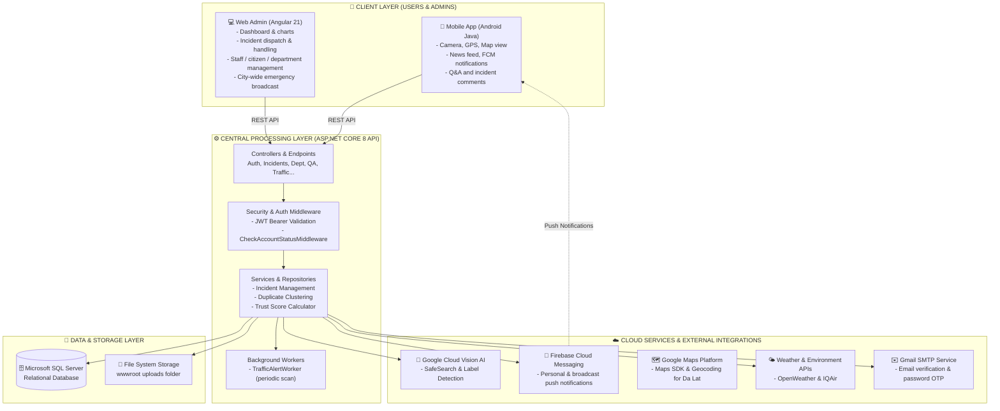

<div align="center">

  <p>
    <a href="README.md">🇻🇳 Tiếng Việt</a> | <b>🇬🇧 English</b>
  </p>

  

  # 🌲 DalatS - URBAN INCIDENT MANAGEMENT SYSTEM FOR DA LAT CITY
  ### *Real-time reporting, dispatch, and monitoring of urban incidents*

  [](https://dotnet.microsoft.com/)
  [](https://angular.dev/)
  [](https://developer.android.com/)
  [](https://firebase.google.com/)
  [](https://cloud.google.com/vision)
  [](https://www.microsoft.com/sql-server)

</div>

---

## 📑 Table of Contents

1. [Project Overview](#project-overview)
2. [Technical Highlights](#technical-highlights)
   - [AI Image Moderation (Google Cloud Vision AI)](#google-cloud-vision-ai)
   - [Real-time Push Notifications (Firebase Cloud Messaging - FCM)](#firebase-cloud-messaging-fcm)
   - [Citizen Trust Score System](#trust-score-system)
   - [Automatic Traffic Alert Worker](#traffic-alert-worker)
   - [Duplicate Incident Detection & Merging](#duplicate-detection)
3. [System Architecture](#system-architecture)
4. [Tech Stack](#tech-stack)
5. [Codebase Structure](#codebase-structure)
6. [Feature Breakdown](#feature-breakdown)
   - [Mobile App (Citizens)](#mobile-app)
   - [Web Admin (Staff & Administrators)](#web-admin)
7. [UI Gallery](#ui-gallery)
   - [Mobile App Screens](#ui-mobile-app)
   - [Web Admin Screens](#ui-web-admin)
8. [Demo Account & Sample Data](#demo-data)
9. [Setup Guide (A-Z)](#setup-guide)
   - [Prerequisites](#prerequisites)
   - [Backend API Setup](#backend-setup)
   - [Web Admin Setup](#web-admin-setup)
   - [Mobile App Setup (Android)](#mobile-setup)
10. [API Endpoints Reference](#api-endpoints)

---

<a id="project-overview"></a>
## 🌿 Project Overview

Da Lat is a major tourist destination with hilly terrain and a fog/monsoon climate, which brings a specific set of urban infrastructure risks: fallen trees, landslides, road damage, flooded drainage, broken streetlights, and traffic jams during peak season.

**DalatS** is a two-way bridge between **citizens** and the **city administration / public service departments**:

- 📣 **Citizens:** take a photo on-site, tag GPS location, submit a report in about 30 seconds, and track the handling progress.
- 🏢 **City administration & staff:** receive reports centrally, auto-route them to the right department (Drainage, Trees, Lighting, Sanitation, Traffic), and cut down on paperwork and hand-offs.
- 🛡️ **Data quality control:** AI moderates uploaded images to filter out fake/spam reports, with built-in emergency broadcast and automatic traffic-jam alerts.

---

<a id="technical-highlights"></a>
## ⚡ Technical Highlights

<a id="google-cloud-vision-ai"></a>
### 1. 🤖 AI Image Moderation (Google Cloud Vision AI)
The backend calls the **`Google.Cloud.Vision.V1`** library directly to moderate every photo citizens upload, right at the API layer (`ImageAnalysisRepository`):
* **SafeSearch Detection:** rejects images flagged as adult (`Adult`), violent (`Violence`), racy (`Racy`), medical/gore (`Medical`), or manipulated (`Spoof`).
* **AI Label Detection (blocking fakes & trolling):** scans labels with a confidence threshold of `Score > 0.65`, and blocks cartoons/anime/drawings (`cartoon`, `anime`, `drawing`), memes (`meme`, `joke`, `snout`), and game/app screenshots (`screenshot`, `pixel art`, `video game`).
* The goal is simple: keep the database limited to real on-site photos that are actually useful for verification and dispatch.

<a id="firebase-cloud-messaging-fcm"></a>
### 2. 🔔 Real-time Push Notifications (Firebase Cloud Messaging - FCM)
Uses the **`Firebase Admin SDK`** on the backend and the **`Firebase Messaging Client`** on the Android app:
* **Personal notifications:** citizens are notified when staff accept a report, move it to "In Progress", resolve it, or reply with a new comment.
* **Task assignment for staff:** when an incident is assigned to a department (or flagged Red/critical), every staff member in that department gets a task notification immediately.
* **City-wide broadcast:** Admins can send emergency alerts or news bulletins to the whole city; the system auto-batches into groups of 500 tokens per Multicast call so delivery doesn't bottleneck.

<a id="trust-score-system"></a>
### 3. ⭐ Citizen Trust Score System
Built to discourage false or spam reports:
* New accounts start with a baseline trust score.
* **+10 points:** when staff verify a report as accurate and move it to "In Progress" / "Resolved".
* **-20 points:** when a report turns out to be false and gets "Rejected".
* Score changes are pushed via FCM and shown in the citizen's profile, which helps admins spot active contributors as well as accounts worth flagging.

<a id="traffic-alert-worker"></a>
### 4. 🚗 Automatic Traffic Alert Worker
A standalone background service, **`TrafficAlertWorker : BackgroundService`**, runs independently:
* Every 5 minutes it re-scans all incidents on the city's main roads.
* When a road accumulates **3 or more simultaneous incidents/accidents** (`ReportCount >= 3`), the worker fires a broadcast alert:
  > *`⚠️ TRAFFIC JAM AT [ROAD NAME]: The system has detected X incidents in this area. Please avoid this route if possible.`*
* A 30-minute cooldown prevents repeat spam, and the alert clears itself once the road is clear again.

<a id="duplicate-detection"></a>
### 5. 🔍 Duplicate Incident Detection & Merging
A major incident (say, a fallen tree on Tran Phu street) usually gets reported by several people at once:
* The system matches GPS coordinates, road, and category to suggest likely duplicates (`SuggestDuplicates`).
* Staff can merge secondary reports into a single **Master Incident** — avoiding duplicate work assignments, keeping the stats clean, and every original reporter still gets notified of the outcome.

---

<a id="system-architecture"></a>
## 🏗️ System Architecture

The system follows a **3-Tier Client-Server (Clean Architecture)** model:



---

<a id="tech-stack"></a>
## 🛠️ Tech Stack

| Layer | Technology / Library | Role & Purpose |
| :--- | :--- | :--- |
| **Backend Core** | **.NET 8 (C#)** | Framework for building the RESTful Web API. |
| | **Entity Framework Core 8** | ORM for data access, relationships, Code-First Migrations. |
| | **Microsoft SQL Server** | Relational database storing all entities. |
| | **JWT Bearer + BCrypt.Net** | Stateless authentication and password hashing. |
| | **Hosted Background Service** | Runs the periodic traffic-hotspot scan (`TrafficAlertWorker`). |
| | **Swashbuckle / Swagger UI** | Auto-generated interactive API docs at `/swagger`. |
| **Cloud & AI** | **Google Cloud Vision v3.8.0** | Moderates uploaded images (SafeSearch & Label Detection). |
| | **Firebase Admin v3.4.0** | Connects to and sends push notifications via FCM. |
| | **Google Maps & Location API** | Heat maps, incident pins, user location. |
| | **OpenWeather & IQAir APIs** | Weather and environmental data for Da Lat. |
| | **MailKit / SMTP Gmail** | Sends verification, OTP, and account-lock emails. |
| **Web Admin** | **Angular 21 (Modern Angular)** | SPA, Standalone Components, Reactive Forms. |
| | **TypeScript 5.9** | Client-side language with static typing. |
| | **Chart.js & ng2-charts 8.0** | Dashboard charts (Doughnut, Bar, Line). |
| | **FontAwesome 7 Free** | Icon set for the admin UI. |
| | **RxJS 7.8** | Async handling, data streams, HTTP interceptors. |
| **Mobile App** | **Android Native (Java 17)** | Native Android application. |
| | **Retrofit 2.9 & Gson** | HTTP client for REST calls and JSON (de)serialization. |
| | **Firebase Messaging 23.4** | Receives and displays notifications on Android. |
| | **Glide 4.16** | Image loading/caching with compression. |
| | **Google Play Services Maps 18.2** | Satellite/traffic map inside the app. |
| | **PhotoView 2.3** | Pinch-to-zoom for on-site photos. |

---

<a id="codebase-structure"></a>
## 📂 Codebase Structure

```text
Project_DaLatS/
├── DalatS/                           # 📱 ANDROID NATIVE APP (JAVA)
│   ├── app/
│   │   ├── build.gradle.kts          # Dependencies (Retrofit, Glide, Firebase, Maps)
│   │   ├── google-services.json      # Firebase project connection config
│   │   └── src/main/
│   │       ├── AndroidManifest.xml   # Permissions, FCM service & activities
│   │       ├── java/com/example/dalats/
│   │       │   ├── activity/         # 15+ screens (Main, Report, IncidentDetail, Weather, Map...)
│   │       │   ├── adapter/          # RecyclerView adapters (Incident, Comment, Slider, QA...)
│   │       │   ├── api/              # Retrofit client, ApiService, DTOs
│   │       │   ├── model/            # Data models (User, Incident, Notification, Category...)
│   │       │   └── service/          # MyFirebaseService (background notification handling)
│   │       └── res/                  # XML layouts, drawables, mipmap, styles
│   └── build.gradle.kts
│
├── DalatS_Admin/                     # 💻 ADMIN WEB PLATFORM (ANGULAR 21)
│   ├── src/
│   │   ├── app/
│   │   │   ├── guards/               # Route guards (AuthGuard, AdminGuard)
│   │   │   ├── layout/               # Header, sidebar, main layout
│   │   │   ├── models/               # TypeScript interfaces (Incident, User, Staff, QA...)
│   │   │   ├── pages/                # Feature pages:
│   │   │   │   ├── dashboard/        # Incident stats and alert charts
│   │   │   │   ├── incidents/        # Incident list & review
│   │   │   │   ├── citizens/         # Citizen management & trust score
│   │   │   │   ├── staff/            # Staff management & department assignment
│   │   │   │   ├── departments/      # Department management
│   │   │   │   ├── categories/       # Incident category management
│   │   │   │   ├── notification-sender/ # FCM broadcast center
│   │   │   │   ├── qa/               # Citizen Q&A intake and replies
│   │   │   │   └── login/            # Admin login screen
│   │   │   └── services/             # Angular injectable services calling the backend API
│   │   └── index.html
│   ├── package.json
│   └── angular.json
│
├── SafeDalat_API/                    # ⚙️ BACKEND API SERVER (ASP.NET CORE 8)
│   ├── SafeDalat_API/
│   │   ├── Controllers/              # 10+ RESTful API controllers
│   │   │   ├── AuthController.cs     # Register, login, profile, OTP, FCM token
│   │   │   ├── IncidentsController.cs# Incident CRUD, filtering, merging, map
│   │   │   ├── NotificationsController.cs # Notification management & broadcast
│   │   │   ├── DashboardController.cs# Analytics data for admin
│   │   │   ├── QAController.cs       # Citizen ↔ government Q&A forum
│   │   │   ├── TrafficController.cs  # Traffic hotspots
│   │   │   └── EnvironmentController.cs # AQI and weather for Da Lat
│   │   ├── Data/
│   │   │   ├── AppDbContext.cs       # EF Core DbContext
│   │   │   └── DemoSeeder.cs         # Loads sample/demo data for Da Lat
│   │   ├── Middleware/
│   │   │   └── CheckAccountStatusMiddleware.cs # Blocks sessions for locked accounts
│   │   ├── Repositories/
│   │   │   ├── Interface/            # Repository & service interfaces
│   │   │   └── Services/             # Service implementations (ImageAnalysis AI, FCM, Email, Traffic...)
│   │   ├── Workers/
│   │   │   └── TrafficAlertWorker.cs # Hosted background service, periodic traffic scan
│   │   ├── appsettings.json          # Connection string, JWT, API keys
│   │   ├── firebase-key.json         # Firebase Admin service account key
│   │   ├── safedalat-key.json        # Google Cloud Vision service account key
│   │   └── Program.cs                # Entry point: DI, pipeline & middleware config
│   ├── scripts/                      # PowerShell scripts for testing and demo image seeding
│   ├── DEMO.md                       # Detailed sample-data documentation
│   └── SafeDalat_API.sln
│
└── docs/                             # 📸 PROJECT DOCS & IMAGES
    └── images/
        ├── logo.png                  # DalatS logo
        ├── mobile/                   # 6 mobile app screenshots
        └── web/                      # 8 web admin screenshots
```

---

<a id="feature-breakdown"></a>
## 🎯 Feature Breakdown

<a id="mobile-app"></a>
### 📱 Mobile App (Citizens)
* **Authentication:** sign-up with email verification via activation link; password change/reset via OTP sent to the user's inbox.
* **Reporting an incident:**
  - Take a photo directly or pick one from the gallery.
  - GPS coordinates are captured automatically, with road/ward suggestions.
  - Choose a category: Traffic, Sanitation, Trees, Lighting, Drainage...
  - Set an urgency level (Normal, Yellow, Orange, Red).
  - **Google Cloud Vision AI runs automatically:** blocks the submission on the spot if the image is a drawing, meme, game screenshot, or 18+ content.
* **Incident map:** shows markers for nearby public incidents, so citizens know which streets are under construction or hazardous.
* **Government Q&A:** post questions about urban order, paperwork, or social services and get official answers from authorized staff.
* **Incident comments:** citizens can discuss and add updates under each incident.
* **Utilities:** real-time weather (temperature, humidity, rain chance) and AQI.
* **Profile:** track report history and trust score.

---

<a id="web-admin"></a>
### 💻 Web Admin (Staff & Administrators)
* **Role-based access (RBAC):**
  - **Administrator:** full access to the dashboard, citizen accounts, staff, departments, incident categories, and city-wide broadcast.
  - **Staff / Manager:** sees and handles only incidents within their own department's scope (e.g. Trees staff only handle fallen/broken trees; Lighting staff only handle broken streetlights); can also answer Q&A.
* **Dashboard:**
  - Incident breakdown by urgency level (Green, Yellow, Orange, Red).
  - Incident distribution by infrastructure category.
  - Total counts: pending review, in progress, resolved.
* **Incident handling & dispatch:**
  - View high-resolution photos, zoom in to inspect the site.
  - View the exact location on the map.
  - Route the incident to the correct department.
  - Update status with resolution notes.
  - Automatically apply +10 or -20 to the reporter's trust score.
* **Duplicate merging:** detects reports matching in location/content and merges them into the original incident.
* **Citizen management & violations:**
  - Citizen list, trust score lookup, count of accurate/false reports.
  - Lock/unlock accounts: enter a reason, and the system auto-sends a notification email and blocks login via middleware immediately.
* **City-wide broadcast center:** send regular or emergency bulletins to every device registered with FCM.

---

<a id="ui-gallery"></a>
## 📸 UI Gallery

<a id="ui-mobile-app"></a>
### Mobile App Screens

| Home & News Feed | Incident Report (AI-integrated) | Incident Detail & Progress |
| :---: | :---: | :---: |
|  |  |  |

| Incident Map | Q&A Section | Profile & Trust Score |
| :---: | :---: | :---: |
|  |  |  |

---

<a id="ui-web-admin"></a>
### Web Admin Screens

#### 1. Dashboard
<p align="center">
  
</p>

#### 2. Incident intake & dispatch
<p align="center">
  
</p>

#### 3. Citizen management & trust score
| Citizen list & trust score | Citizen detail & report history |
| :---: | :---: |
|  |  |

#### 4. Staff & department management
| Staff list by department | Staff detail & permissions |
| :---: | :---: |
|  |  |

#### 5. Category management & Q&A
| Incident category management | Q&A management & replies |
| :---: | :---: |
|  |  |

---

<a id="demo-data"></a>
## 👥 Demo Account & Sample Data

`DemoSeeder.cs` preloads a sample dataset for testing.

> [!NOTE]
> 📌 **For sample-data setup and test scenarios, see:** 👉 **[DEMO.md](SafeDalat_API/DEMO.md)**

---

<a id="setup-guide"></a>
## 🚀 Setup Guide (A-Z)

<a id="prerequisites"></a>
### 1. Prerequisites
* **OS:** Windows 10/11, macOS, or Linux.
* **.NET SDK:** .NET 8.0 SDK or later.
* **Node.js & npm:** Node.js >= v18 (v20.x or v22.x LTS recommended) and npm.
* **Database:** Microsoft SQL Server 2019/2022, or SQL Server Express / LocalDB.
* **Mobile tooling:** Android Studio (Hedgehog / Iguana / Koala or later) and JDK 17.

---

<a id="backend-setup"></a>
### 2. Backend API Setup

#### Step 2.1: Clone the repo
```bash
git clone https://github.com/Danter34/Project_DaLatS.git
cd Project_DaLatS/SafeDalat_API/SafeDalat_API
```

#### Step 2.2: Configure `appsettings.json`
Open the file and fill in your database connection and service keys:
```json
{
  "ConnectionStrings": {
    "SafeDalatConnection": "Server=localhost;Database=dalats;Integrated Security=True;TrustServerCertificate=True;"
  },
  "Jwt": {
    "Key": "YOUR_SECRET_KEY_AT_LEAST_32_CHARACTERS_LONG_123456",
    "Issuer": "http://localhost:5084",
    "Audience": "http://localhost:5084",
    "ExpireHours": 6
  },
  "Email": {
    "Host": "smtp.gmail.com",
    "Port": 587,
    "Username": "your_email@gmail.com",
    "Password": "your_app_password"
  },
  "IQAir": {
    "ApiKey": "YOUR_IQAIR_API_KEY"
  },
  "OpenWeather": {
    "ApiKey": "YOUR_OPENWEATHER_API_KEY"
  }
}
```

#### Step 2.3: Add Cloud Vision & Firebase keys
Place these key files in `SafeDalat_API/SafeDalat_API/`:
1. `firebase-key.json`: from Firebase Console → *Project Settings* → *Service Accounts* → *Generate new private key*.
2. `safedalat-key.json`: from Google Cloud Console → *IAM & Admin* → *Service Accounts* (needs Cloud Vision API access).

#### Step 2.4: Seed demo data & run
From the `Project_DaLatS` folder:

```powershell
# Seed demo data (only needs to run once)
dotnet run --project SafeDalat_API/SafeDalat_API/SafeDalat_API.csproj --launch-profile http -- --seed-demo

# Run the backend API server
dotnet run --project SafeDalat_API/SafeDalat_API/SafeDalat_API.csproj --launch-profile http
```
* Backend runs at: **`http://localhost:5084`**
* Swagger UI: **`http://localhost:5084/swagger`**

---

<a id="web-admin-setup"></a>
### 3. Web Admin Setup

#### Step 3.1: Install dependencies
```bash
cd Project_DaLatS/DalatS_Admin
npm install
```

#### Step 3.2: Run the dev server
```bash
npm start
# or
ng serve --port 4200
```
* Open: **`http://localhost:4200`**
* Admin login: `admin@demo.dalats.test` / `DalatS@Demo2026`.

---

<a id="mobile-setup"></a>
### 4. Mobile App Setup (Android)

#### Step 4.1: Open the project in Android Studio
* Open Android Studio → **Open** → select the `Project_DaLatS/DalatS` folder.
* Wait for Gradle Sync to finish.

#### Step 4.2: Configure `google-services.json` & Maps API Key
* Make sure `DalatS/app/google-services.json` matches your Firebase app (package name: `com.example.dalats`).
* Open `DalatS/app/src/main/AndroidManifest.xml` and fill in your Maps API key:
  ```xml
  <meta-data
      android:name="com.google.android.geo.API_KEY"
      android:value="YOUR_GOOGLE_MAPS_API_KEY" />
  ```

#### Step 4.3: Note on `BASE_URL`
* By default, Retrofit points to `http://10.0.2.2:5084/` — the standard loopback address the **Android Emulator** uses to reach the host machine.
* Running on a **physical device** over USB/Wi-Fi: open `DalatS/app/src/main/java/com/example/dalats/api/ApiClient.java` and change it to your machine's local network IP (e.g. `http://192.168.1.15:5084/`).

#### Step 4.4: Build & Run
* Select an emulator or a physical device (with Developer Mode on).
* Click **Run 'app'** (Shift + F10).

---

<a id="api-endpoints"></a>
## 📡 API Endpoints Reference

### 🔐 1. Auth & Accounts (`/api/Auth`)
* `POST /api/Auth/register`: register a new account (sends activation email).
* `POST /api/Auth/login`: log in, returns a JWT token and user info.
* `GET  /api/Auth/verify-email`: confirm activation via email token.
* `POST /api/Auth/forgot-password`: request a password-reset OTP.
* `POST /api/Auth/reset-password`: set a new password using an OTP.
* `GET  /api/Auth/profile`: get the current logged-in user's info.
* `PUT  /api/Auth/update-fcm`: update the FCM device token.
* `PUT  /api/Auth/{id}/lock` & `unlock`: [Admin] lock/unlock an account.
* `POST /api/Auth/create-staff`: [Admin] provision a staff account.

### 🚨 2. Urban Incidents (`/api/Incidents`)
* `POST /api/Incidents`: create a report with a photo (auto AI Vision moderation).
* `GET  /api/Incidents`: search, paginate, filter by status/department/ward/urgency.
* `GET  /api/Incidents/{id}`: incident detail — photos, status history, comments.
* `PUT  /api/Incidents/{id}/status`: [Staff/Admin] change status, dispatch to a department, update trust score.
* `GET  /api/Incidents/suggest-duplicates/{id}`: suggest likely duplicate incidents.
* `POST /api/Incidents/merge`: merge duplicate incidents into one.
* `GET  /api/Incidents/map`: public incidents for the map view.

### 💬 3. Comments (`/api/IncidentComments`)
* `GET  /api/IncidentComments/{incidentId}`: list comments for an incident.
* `POST /api/IncidentComments/{incidentId}`: post a new comment.

### ❓ 4. Government Q&A (`/api/QA`)
* `GET  /api/QA`: list citizen questions.
* `POST /api/QA`: submit a new question.
* `POST /api/QA/{id}/answer`: [Staff] post an official reply.

### 📢 5. Notifications & Broadcast (`/api/Notifications`)
* `GET  /api/Notifications/my-notifications`: personal notifications.
* `PUT  /api/Notifications/{id}/read`: mark a notification as read.
* `POST /api/Notifications/broadcast`: [Admin] send a city-wide broadcast via FCM.

### 📊 6. Dashboard & Analytics (`/api/Dashboard`)
* `GET /api/Dashboard/summary`: [Admin] total incidents by status.
* `GET /api/Dashboard/by-alert`: [Admin] incident ratio by alert level.
* `GET /api/Dashboard/by-category`: [Admin] incidents by infrastructure category.

### 🚦 7. Traffic & Environment (`/api/Traffic` & `/api/Environment`)
* `GET /api/Traffic/hotspots`: roads at high risk of congestion.
* `GET /api/Environment/weather`: weather forecast for Da Lat from OpenWeather API.
* `GET /api/Environment/air-quality`: AQI for Da Lat from IQAir API.

---
