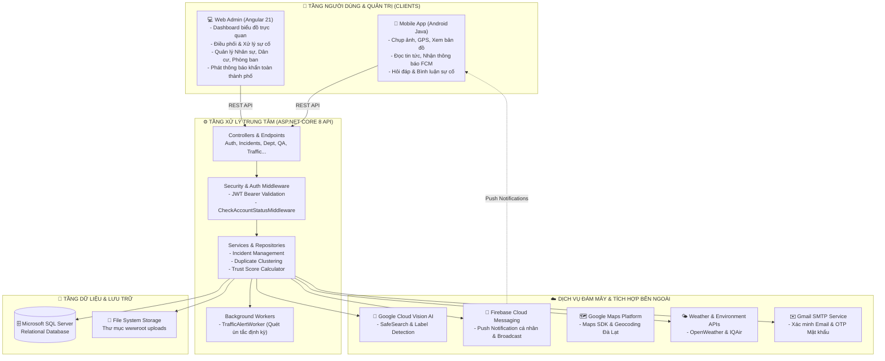

<div align="center">

  

  # 🌲 DalatS - HỆ THỐNG QUẢN LÝ SỰ CỐ ĐÔ THỊ THÀNH PHỐ ĐÀ LẠT
  ### *Tiếp nhận, điều phối và giám sát sự cố đô thị theo thời gian thực*

  [](https://dotnet.microsoft.com/)
  [](https://angular.dev/)
  [](https://developer.android.com/)
  [](https://firebase.google.com/)
  [](https://cloud.google.com/vision)
  [](https://www.microsoft.com/sql-server)

</div>

---

## 📑 Mục lục

1. [Giới thiệu Dự án](#gioi-thieu-du-an)
2. [Điểm sáng Công nghệ & Tính năng Nổi bật](#diem-sang-cong-nghe)
   - [Trí tuệ nhân tạo kiểm duyệt ảnh (Google Cloud Vision AI)](#google-cloud-vision-ai)
   - [Hệ thống Thông báo Đẩy thời gian thực (Firebase Cloud Messaging - FCM)](#firebase-cloud-messaging-fcm)
   - [Hệ thống Điểm uy tín Công dân (Trust Score System)](#trust-score-system)
   - [Cảnh báo Ùn tắc Giao thông Tự động (Traffic Alert Worker)](#traffic-alert-worker)
   - [Phát hiện và Hợp nhất Sự cố Trùng lặp (Duplicate Detection)](#duplicate-detection)
3. [Kiến trúc Hệ thống (System Architecture)](#kien-truc-he-thong)
4. [Tech Stack Toàn diện](#tech-stack)
5. [Cấu trúc Thư mục Codebase](#cau-truc-thu-muc)
6. [Phân hệ Chức năng Chi tiết](#phan-he-chuc-nang)
   - [Ứng dụng Di động (Mobile App - Người dân)](#mobile-app)
   - [Trang Quản trị (Web Admin - Cán bộ & Quản trị viên)](#web-admin)
7. [Hình ảnh Giao diện Thực tế (UI Gallery)](#hinh-anh-giao-dien)
   - [Giao diện Mobile App](#ui-mobile-app)
   - [Giao diện Web Admin](#ui-web-admin)
8. [Tài khoản Demo & Dữ liệu Mẫu (Demo Data)](#tai-khoan-demo)
9. [Hướng dẫn Cài đặt & Khởi chạy từ A-Z](#huong-dan-cai-dat)
   - [Yêu cầu Môi trường](#yeu-cau-moi-truong)
   - [Cấu hình & Khởi chạy Backend API](#cai-dat-backend-api)
   - [Cấu hình & Khởi chạy Web Admin](#cai-dat-web-admin)
   - [Cấu hình & Khởi chạy Mobile App (Android)](#cai-dat-mobile-app)
10. [Danh mục API Endpoints (RESTful API)](#danh-muc-api)

---

<a id="gioi-thieu-du-an"></a>
## 🌿 Giới thiệu Dự án

Đà Lạt là trung tâm du lịch với địa hình đồi dốc, khí hậu sương mù mưa bão đặc thù, kéo theo nhiều rủi ro hạ tầng đô thị: cây đổ, sạt lở, mặt đường hư hỏng, cống thoát nước ngập úng, đèn chiếu sáng hỏng và ùn ứ giao thông vào mùa cao điểm.

**DalatS** là cầu nối hai chiều giữa **người dân** và **chính quyền thành phố / các đơn vị sự nghiệp công ích**:

- 📣 **Người dân:** chụp ảnh hiện trường, định vị GPS, gửi báo cáo trong khoảng 30 giây và theo dõi tiến độ xử lý.
- 🏢 **Chính quyền & cán bộ phụ trách:** tiếp nhận tập trung, phân luồng tự động tới đúng phòng ban (Thoát nước, Cây xanh, Chiếu sáng, Vệ sinh, Giao thông), giảm bớt giấy tờ và các bước trung gian.
- 🛡️ **Kiểm soát chất lượng dữ liệu:** AI kiểm duyệt hình ảnh để hạn chế ảnh giả/spam, kèm cơ chế đẩy thông báo khẩn cấp và cảnh báo ùn tắc tự động.

---

<a id="diem-sang-cong-nghe"></a>
## ⚡ Điểm sáng Công nghệ & Tính năng Nổi bật

<a id="google-cloud-vision-ai"></a>
### 1. 🤖 Trí tuệ nhân tạo kiểm duyệt ảnh (Google Cloud Vision AI)
Hệ thống gọi trực tiếp thư viện **`Google.Cloud.Vision.V1`** để kiểm duyệt mọi ảnh người dân tải lên, ngay tại tầng Backend (`ImageAnalysisRepository`):
* **SafeSearch Detection:** từ chối ảnh có yếu tố khiêu dâm (`Adult`), bạo lực (`Violence`), nhạy cảm (`Racy`), y tế/kinh dị (`Medical`) hoặc dấu hiệu cắt ghép (`Spoof`).
* **AI Label Detection (chặn tin giả & troll):** phân tích nhãn với ngưỡng `Score > 0.65`, chặn ảnh hoạt hình (`cartoon`, `anime`, `drawing`), ảnh chế (`meme`, `joke`, `snout`), ảnh chụp màn hình game/ứng dụng (`screenshot`, `pixel art`, `video game`).
* Mục tiêu là để dữ liệu trong hệ thống chỉ gồm ảnh chụp hiện trường thật, có thể dùng để xác minh và xử lý.

<a id="firebase-cloud-messaging-fcm"></a>
### 2. 🔔 Hệ thống Thông báo Đẩy thời gian thực (Firebase Cloud Messaging - FCM)
Dùng **`Firebase Admin SDK`** ở Backend và **`Firebase Messaging Client`** ở app Android:
* **Thông báo cá nhân:** báo cho người dân khi cán bộ tiếp nhận, chuyển "Đang xử lý", hoàn thành, hoặc có bình luận mới.
* **Giao việc cho cán bộ:** khi sự cố được gán cho một phòng ban (hoặc ở mức báo động Đỏ), toàn bộ cán bộ phòng ban đó nhận thông báo ngay.
* **Phát thanh diện rộng:** Admin gửi thông báo khẩn hoặc bản tin tới toàn thành phố; hệ thống tự chia gói Multicast 500 token/lô để gửi không bị nghẽn.

<a id="trust-score-system"></a>
### 3. ⭐ Hệ thống Điểm uy tín Công dân (Trust Score System)
Mục đích là hạn chế phản ánh sai sự thật:
* Tài khoản mới có điểm uy tín khởi điểm.
* **+10 điểm:** khi cán bộ xác minh phản ánh đúng và chuyển "Đang xử lý" / "Đã hoàn thành".
* **-20 điểm:** khi phản ánh là tin giả và bị "Từ chối".
* Biến động điểm được báo qua FCM và hiện trong hồ sơ cá nhân, giúp Admin nhận ra công dân đóng góp tích cực hoặc tài khoản cần theo dõi.

<a id="traffic-alert-worker"></a>
### 4. 🚗 Cảnh báo Ùn tắc Giao thông Tự động (Traffic Alert Worker)
Một background service riêng, **`TrafficAlertWorker : BackgroundService`**, chạy độc lập:
* Cứ 5 phút quét lại toàn bộ sự cố trên các tuyến đường chính nội ô.
* Khi một tuyến có từ **3 sự cố/tai nạn trở lên cùng lúc** (`ReportCount >= 3`), Worker gửi cảnh báo diện rộng:
  > *`⚠️ ÙN TẮC TẠI [TÊN ĐƯỜNG]: Hệ thống phát hiện X sự cố tại khu vực này. Vui lòng hạn chế di chuyển qua đây.`*
* Có cooldown 30 phút để không spam thông báo lặp, và tự dọn khi tuyến đường đã thông thoáng.

<a id="duplicate-detection"></a>
### 5. 🔍 Phát hiện và Hợp nhất Sự cố Trùng lặp (Duplicate Detection)
Một sự cố lớn (ví dụ cây ngã trên đường Trần Phú) thường có nhiều người cùng báo:
* Hệ thống so khớp tọa độ GPS, tuyến đường và danh mục để gợi ý các báo cáo trùng (`SuggestDuplicates`).
* Cán bộ có thể gộp các phản ánh phụ vào một **Master Incident** — tránh phân công trùng người xử lý, dữ liệu thống kê gọn hơn, và tất cả người báo cáo vẫn nhận được cập nhật kết quả.

---

<a id="kien-truc-he-thong"></a>
## 🏗️ Kiến trúc Hệ thống (System Architecture)

Hệ thống theo mô hình **Client-Server 3 lớp (3-Tier Clean Architecture)**:



---

<a id="tech-stack"></a>
## 🛠️ Tech Stack

| Phân hệ | Công nghệ / Thư viện | Vai trò & Mục đích sử dụng |
| :--- | :--- | :--- |
| **Backend Core** | **.NET 8 (C#)** | Framework xây dựng RESTful Web API. |
| | **Entity Framework Core 8** | ORM quản lý dữ liệu, quan hệ bảng, Code-First Migrations. |
| | **Microsoft SQL Server** | Database quan hệ, lưu toàn bộ thực thể. |
| | **JWT Bearer + BCrypt.Net** | Xác thực stateless và băm mật khẩu. |
| | **Hosted Background Service** | Chạy tác vụ ngầm định kỳ phân tích điểm nóng giao thông (`TrafficAlertWorker`). |
| | **Swashbuckle / Swagger UI** | Sinh tài liệu API tự động tại `/swagger`. |
| **Cloud & AI** | **Google Cloud Vision v3.8.0** | Kiểm duyệt ảnh đầu vào (SafeSearch & Label Detection). |
| | **Firebase Admin v3.4.0** | Kết nối và gửi Push Notification qua FCM. |
| | **Google Maps & Location API** | Bản đồ nhiệt, ghim vị trí sự cố, định vị người dùng. |
| | **OpenWeather & IQAir APIs** | Dữ liệu môi trường và thời tiết tại Đà Lạt. |
| | **MailKit / SMTP Gmail** | Gửi email xác thực, OTP và thông báo khóa tài khoản. |
| **Web Admin** | **Angular 21 (Modern Angular)** | SPA, Standalone Components, Reactive Forms. |
| | **TypeScript 5.9** | Ngôn ngữ phía client, kiểu dữ liệu tĩnh. |
| | **Chart.js & ng2-charts 8.0** | Biểu đồ Dashboard (Doughnut, Bar, Line). |
| | **FontAwesome 7 Free** | Icon cho giao diện quản trị. |
| | **RxJS 7.8** | Xử lý bất đồng bộ, Data Streams, HTTP Interceptors. |
| **Mobile App** | **Android Native (Java 17)** | Ứng dụng di động cho nền tảng Android. |
| | **Retrofit 2.9 & Gson** | HTTP Client gọi REST API, chuyển đổi JSON. |
| | **Firebase Messaging 23.4** | Nhận và hiển thị Notification trên Android. |
| | **Glide 4.16** | Tải và cache ảnh, nén để giảm dung lượng. |
| | **Google Play Services Maps 18.2** | Bản đồ vệ tinh/giao thông trong app. |
| | **PhotoView 2.3** | Zoom ảnh hiện trường. |

---

<a id="cau-truc-thu-muc"></a>
## 📂 Cấu trúc Thư mục Codebase

```text
Project_DaLatS/
├── DalatS/                           # 📱 ỨNG DỤNG ANDROID NATIVE (JAVA)
│   ├── app/
│   │   ├── build.gradle.kts          # Dependencies (Retrofit, Glide, Firebase, Maps)
│   │   ├── google-services.json      # Cấu hình kết nối Firebase Project
│   │   └── src/main/
│   │       ├── AndroidManifest.xml   # Khai báo Permissions, Service FCM & Activities
│   │       ├── java/com/example/dalats/
│   │       │   ├── activity/         # 15+ Màn hình (Main, Report, IncidentDetail, Weather, Map...)
│   │       │   ├── adapter/          # Recycler View Adapters (Incident, Comment, Slider, QA...)
│   │       │   ├── api/              # Retrofit Client, ApiService, DTOs
│   │       │   ├── model/            # Data Models (User, Incident, Notification, Category...)
│   │       │   └── service/          # MyFirebaseService (Xử lý thông báo ngầm)
│   │       └── res/                  # Layouts XML, Drawables, Mipmap, Styles
│   └── build.gradle.kts
│
├── DalatS_Admin/                     # 💻 TRANG QUẢN TRỊ NỀN TẢNG (ANGULAR 21)
│   ├── src/
│   │   ├── app/
│   │   │   ├── guards/               # Route Guards (AuthGuard, AdminGuard)
│   │   │   ├── layout/               # Header, Sidebar, Main Layout
│   │   │   ├── models/               # TypeScript Interfaces (Incident, User, Staff, QA...)
│   │   │   ├── pages/                # Các trang nghiệp vụ:
│   │   │   │   ├── dashboard/        # Bảng biểu thống kê sự cố và cảnh báo
│   │   │   │   ├── incidents/        # Quản lý danh sách & duyệt phản ánh
│   │   │   │   ├── citizens/         # Quản lý dân cư & điểm uy tín (Trust Score)
│   │   │   │   ├── staff/            # Quản lý cán bộ & phân công phòng ban
│   │   │   │   ├── departments/      # Quản lý phòng ban chuyên trách
│   │   │   │   ├── categories/       # Quản lý danh mục sự cố đô thị
│   │   │   │   ├── notification-sender/ # Trung tâm phát thông báo FCM toàn dân
│   │   │   │   ├── qa/               # Tiếp nhận và giải đáp thắc mắc người dân
│   │   │   │   └── login/            # Màn hình đăng nhập quản trị
│   │   │   └── services/             # Angular Injectable Services gọi Backend API
│   │   └── index.html
│   ├── package.json
│   └── angular.json
│
├── SafeDalat_API/                    # ⚙️ BACKEND API SERVER (ASP.NET CORE 8)
│   ├── SafeDalat_API/
│   │   ├── Controllers/              # 10+ RESTful API Controllers
│   │   │   ├── AuthController.cs     # Đăng ký, Đăng nhập, Profile, OTP, FCM Token
│   │   │   ├── IncidentsController.cs# CRUD Sự cố, Lọc, Gộp trùng lặp, Bản đồ
│   │   │   ├── NotificationsController.cs # Quản lý thông báo & Phát sóng Broadcast
│   │   │   ├── DashboardController.cs# Dữ liệu phân tích thống kê cho Admin
│   │   │   ├── QAController.cs       # Diễn đàn Hỏi - Đáp người dân & chính quyền
│   │   │   ├── TrafficController.cs  # Điểm nóng ùn tắc giao thông
│   │   │   └── EnvironmentController.cs # Chỉ số AQI và Thời tiết Đà Lạt
│   │   ├── Data/
│   │   │   ├── AppDbContext.cs       # DbContext Entity Framework Core
│   │   │   └── DemoSeeder.cs         # Trình nạp dữ liệu giả lập mẫu cho Đà Lạt
│   │   ├── Middleware/
│   │   │   └── CheckAccountStatusMiddleware.cs # Khóa phiên làm việc tài khoản vi phạm
│   │   ├── Repositories/
│   │   │   ├── Interface/            # Định nghĩa Interfaces Repository & Services
│   │   │   └── Services/             # Cài đặt dịch vụ (ImageAnalysis AI, FCM, Email, Traffic...)
│   │   ├── Workers/
│   │   │   └── TrafficAlertWorker.cs # Hosted Background Service quét ùn tắc định kỳ
│   │   ├── appsettings.json          # Cấu hình Connection String, JWT, API Keys
│   │   ├── firebase-key.json         # Firebase Admin Service Account Key
│   │   ├── safedalat-key.json        # Google Cloud Vision Service Account Key
│   │   └── Program.cs                # Entry point cấu hình DI, Pipeline & Middleware
│   ├── scripts/                      # Script Powershell kiểm thử và nạp ảnh demo
│   ├── DEMO.md                       # Tài liệu dữ liệu mẫu chi tiết của hệ thống
│   └── SafeDalat_API.sln
│
└── docs/                             # 📸 TÀI LIỆU & HÌNH ẢNH DỰ ÁN
    └── images/
        ├── logo.png                  # Logo chính thức của DalatS
        ├── mobile/                   # 6 ảnh chụp màn hình ứng dụng di động
        └── web/                      # 8 ảnh chụp màn hình trang quản trị Web
```

---

<a id="phan-he-chuc-nang"></a>
## 🎯 Phân hệ Chức năng Chi tiết

<a id="mobile-app"></a>
### 📱 Ứng dụng Di động (Mobile App - Dành cho Người dân)
* **Xác thực:** đăng ký kèm xác minh email qua link kích hoạt; đổi/quên mật khẩu qua OTP gửi vào hòm thư.
* **Gửi phản ánh sự cố:**
  - Chụp ảnh trực tiếp hoặc chọn từ thư viện.
  - Tự lấy tọa độ GPS và gợi ý tuyến đường/phường.
  - Chọn danh mục: Giao thông, Vệ sinh môi trường, Cây xanh, Chiếu sáng, Thoát nước...
  - Chọn mức độ khẩn cấp (Bình thường, Vàng, Cam, Đỏ).
  - **Google Cloud Vision AI chạy tự động:** chặn ngay ở khâu gửi nếu ảnh là ảnh vẽ, meme, game hoặc nội dung 18+.
* **Bản đồ sự cố:** hiển thị marker các sự cố công khai gần khu vực, để người dân biết đoạn đường nào đang thi công hoặc nguy hiểm.
* **Hỏi - Đáp Công quyền:** đăng câu hỏi về trật tự đô thị, giấy tờ, an sinh, nhận trả lời từ cán bộ có thẩm quyền.
* **Bình luận sự cố:** người dân thảo luận, bổ sung thông tin dưới từng sự cố.
* **Tiện ích:** thời tiết real-time (nhiệt độ, độ ẩm, khả năng mưa) và chỉ số AQI.
* **Hồ sơ cá nhân:** theo dõi lịch sử phản ánh và điểm uy tín.

---

<a id="web-admin"></a>
### 💻 Trang Quản trị (Web Admin - Dành cho Cán bộ & Quản trị viên)
* **Phân quyền (RBAC):**
  - **Administrator:** toàn quyền Dashboard, quản lý tài khoản công dân, nhân viên/cán bộ, phòng ban, danh mục sự cố, và phát thông báo toàn thành phố.
  - **Staff / Manager:** chỉ xem và xử lý sự cố thuộc phòng ban mình (ví dụ cán bộ Cây xanh chỉ xử lý cây đổ, gãy cành; cán bộ Chiếu sáng xử lý đèn hỏng); tham gia trả lời Q&A.
* **Dashboard:**
  - Tỷ lệ sự cố theo cấp độ khẩn cấp (Xanh, Vàng, Cam, Đỏ).
  - Phân bổ sự cố theo danh mục hạ tầng.
  - Tổng số phản ánh: chờ duyệt, đang xử lý, đã giải quyết.
* **Xử lý & điều phối sự cố:**
  - Xem ảnh độ phân giải cao, phóng to kiểm tra hiện trường.
  - Xem vị trí trên bản đồ.
  - Chuyển sự cố về đúng phòng ban.
  - Cập nhật trạng thái kèm ghi chú kết quả.
  - Tự động +10 hoặc -20 điểm uy tín của người báo cáo.
* **Gộp sự cố trùng lặp:** phát hiện phản ánh trùng vị trí/nội dung, gộp vào sự cố gốc.
* **Quản lý dân cư & vi phạm:**
  - Danh sách công dân, điểm uy tín, số phản ánh đúng/sai.
  - Khóa/mở khóa tài khoản: nhập lý do, hệ thống tự gửi email thông báo và middleware chặn đăng nhập ngay lập tức.
* **Phát thông báo toàn thành phố:** gửi bản tin (thường hoặc khẩn cấp) tới các thiết bị đã đăng ký FCM.

---

<a id="hinh-anh-giao-dien"></a>
## 📸 Hình ảnh Giao diện Thực tế (UI Gallery)

<a id="ui-mobile-app"></a>
### Giao diện Mobile App

| Trang chủ & Bản tin | Báo cáo sự cố (Tích hợp AI) | Chi tiết sự cố & Tiến độ |
| :---: | :---: | :---: |
|  |  |  |

| Bản đồ số sự cố đô thị | Chuyên mục Hỏi - Đáp (Q&A) | Hồ sơ & Điểm uy tín |
| :---: | :---: | :---: |
|  |  |  |

---

<a id="ui-web-admin"></a>
### Giao diện Web Admin

#### 1. Dashboard thống kê
<p align="center">
  
</p>

#### 2. Tiếp nhận & điều phối sự cố
<p align="center">
  
</p>

#### 3. Quản lý dân cư & điểm uy tín
| Danh sách Người dân & Điểm uy tín | Hồ sơ Chi tiết & Lịch sử Báo cáo |
| :---: | :---: |
|  |  |

#### 4. Quản lý nhân sự & phòng ban
| Danh sách Cán bộ theo Đơn vị | Hồ sơ Cán bộ & Phân quyền |
| :---: | :---: |
|  |  |

#### 5. Quản lý danh mục sự cố & Q&A
| Danh mục Phân loại Sự cố | Quản lý & Phản hồi Hỏi - Đáp |
| :---: | :---: |
|  |  |

---

<a id="tai-khoan-demo"></a>
## 👥 Tài khoản Demo & Dữ liệu Mẫu (Demo Data)

`DemoSeeder.cs` nạp sẵn một bộ dữ liệu demo để chạy thử.

> [!NOTE]
> 📌 **Hướng dẫn nạp dữ liệu mẫu và kịch bản test:** 👉 **[DEMO.md](SafeDalat_API/DEMO.md)**

---

<a id="huong-dan-cai-dat"></a>
## 🚀 Hướng dẫn Cài đặt & Khởi chạy từ A-Z

<a id="yeu-cau-moi-truong"></a>
### 1. Yêu cầu Môi trường (Prerequisites)
* **Hệ điều hành:** Windows 10/11, macOS, hoặc Linux.
* **.NET SDK:** .NET 8.0 SDK trở lên.
* **Node.js & npm:** Node.js >= v18 (khuyến nghị v20.x hoặc v22.x LTS) và npm.
* **Cơ sở dữ liệu:** Microsoft SQL Server 2019/2022 hoặc SQL Server Express / LocalDB.
* **Mobile Tooling:** Android Studio (Hedgehog / Iguana / Koala trở lên) và JDK 17.

---

<a id="cai-dat-backend-api"></a>
### 2. Cấu hình & Khởi chạy Backend API

#### Bước 2.1: Clone dự án & điều hướng thư mục
```bash
git clone https://github.com/Danter34/Project_DaLatS.git
cd Project_DaLatS/SafeDalat_API/SafeDalat_API
```

#### Bước 2.2: Cấu hình `appsettings.json`
Mở file và cập nhật thông số kết nối database cùng các khóa dịch vụ:
```json
{
  "ConnectionStrings": {
    "SafeDalatConnection": "Server=localhost;Database=dalats;Integrated Security=True;TrustServerCertificate=True;"
  },
  "Jwt": {
    "Key": "YOUR_SECRET_KEY_AT_LEAST_32_CHARACTERS_LONG_123456",
    "Issuer": "http://localhost:5084",
    "Audience": "http://localhost:5084",
    "ExpireHours": 6
  },
  "Email": {
    "Host": "smtp.gmail.com",
    "Port": 587,
    "Username": "your_email@gmail.com",
    "Password": "your_app_password"
  },
  "IQAir": {
    "ApiKey": "YOUR_IQAIR_API_KEY"
  },
  "OpenWeather": {
    "ApiKey": "YOUR_OPENWEATHER_API_KEY"
  }
}
```

#### Bước 2.3: Thêm khóa Cloud Vision & Firebase
Đặt các file khóa vào `SafeDalat_API/SafeDalat_API/`:
1. `firebase-key.json`: từ Firebase Console → *Project Settings* → *Service Accounts* → *Generate new private key*.
2. `safedalat-key.json`: từ Google Cloud Console → *IAM & Admin* → *Service Accounts* (cần quyền truy cập Cloud Vision API).

#### Bước 2.4: Nạp dữ liệu Seeder Demo & chạy ứng dụng
Terminal tại thư mục `Project_DaLatS`:

```powershell
# Nạp dữ liệu mẫu Demo (chỉ cần chạy 1 lần)
dotnet run --project SafeDalat_API/SafeDalat_API/SafeDalat_API.csproj --launch-profile http -- --seed-demo

# Khởi chạy Backend API Server
dotnet run --project SafeDalat_API/SafeDalat_API/SafeDalat_API.csproj --launch-profile http
```
* Backend chạy tại: **`http://localhost:5084`**
* Swagger UI: **`http://localhost:5084/swagger`**

---

<a id="cai-dat-web-admin"></a>
### 3. Cấu hình & Khởi chạy Web Admin

#### Bước 3.1: Cài dependencies
```bash
cd Project_DaLatS/DalatS_Admin
npm install
```

#### Bước 3.2: Chạy dev server
```bash
npm start
# hoặc
ng serve --port 4200
```
* Truy cập: **`http://localhost:4200`**
* Tài khoản Admin: `admin@demo.dalats.test` / `DalatS@Demo2026`.

---

<a id="cai-dat-mobile-app"></a>
### 4. Cấu hình & Khởi chạy Mobile App (Android)

#### Bước 4.1: Mở dự án trong Android Studio
* Mở Android Studio → **Open** → chọn thư mục `Project_DaLatS/DalatS`.
* Chờ Gradle Sync tải xong thư viện.

#### Bước 4.2: Cấu hình `google-services.json` & Maps API Key
* Đảm bảo `DalatS/app/google-services.json` khớp với Firebase App của bạn (package name: `com.example.dalats`).
* Mở `DalatS/app/src/main/AndroidManifest.xml`, điền Maps API Key:
  ```xml
  <meta-data
      android:name="com.google.android.geo.API_KEY"
      android:value="YOUR_GOOGLE_MAPS_API_KEY" />
  ```

#### Bước 4.3: Lưu ý về `BASE_URL`
* Mặc định Retrofit trỏ tới `http://10.0.2.2:5084/` — địa chỉ loopback chuẩn của **Android Emulator** về máy host.
* Chạy trên **điện thoại thật** qua USB/Wi-Fi: mở `DalatS/app/src/main/java/com/example/dalats/api/ApiClient.java` và đổi sang IP nội mạng của máy bạn (ví dụ `http://192.168.1.15:5084/`).

#### Bước 4.4: Build & Run
* Chọn Emulator hoặc điện thoại thật (đã bật Developer Mode).
* Nhấn **Run 'app'** (Shift + F10).

---

<a id="danh-muc-api"></a>
## 📡 Danh mục API Endpoints (RESTful API)

### 🔐 1. Xác thực & Tài khoản (`/api/Auth`)
* `POST /api/Auth/register`: đăng ký tài khoản mới (gửi email kích hoạt).
* `POST /api/Auth/login`: đăng nhập, trả về JWT Token và thông tin User.
* `GET  /api/Auth/verify-email`: xác nhận kích hoạt qua token email.
* `POST /api/Auth/forgot-password`: yêu cầu OTP đặt lại mật khẩu.
* `POST /api/Auth/reset-password`: đặt mật khẩu mới bằng OTP.
* `GET  /api/Auth/profile`: thông tin người dùng đang đăng nhập.
* `PUT  /api/Auth/update-fcm`: cập nhật FCM Device Token.
* `PUT  /api/Auth/{id}/lock` & `unlock`: [Admin] khóa/mở khóa tài khoản.
* `POST /api/Auth/create-staff`: [Admin] cấp tài khoản cán bộ.

### 🚨 2. Sự cố Đô thị (`/api/Incidents`)
* `POST /api/Incidents`: tạo báo cáo kèm ảnh (tự động kiểm duyệt AI Vision).
* `GET  /api/Incidents`: tra cứu, phân trang, lọc theo trạng thái/phòng ban/phường/mức khẩn cấp.
* `GET  /api/Incidents/{id}`: chi tiết sự cố, ảnh, lịch sử trạng thái, bình luận.
* `PUT  /api/Incidents/{id}/status`: [Cán bộ/Admin] chuyển trạng thái, điều phối phòng ban, cập nhật Trust Score.
* `GET  /api/Incidents/suggest-duplicates/{id}`: gợi ý sự cố trùng lặp.
* `POST /api/Incidents/merge`: hợp nhất sự cố trùng lặp.
* `GET  /api/Incidents/map`: danh sách sự cố công khai trên bản đồ.

### 💬 3. Tương tác & Bình luận (`/api/IncidentComments`)
* `GET  /api/IncidentComments/{incidentId}`: danh sách bình luận theo sự cố.
* `POST /api/IncidentComments/{incidentId}`: gửi bình luận mới.

### ❓ 4. Hỏi - Đáp Công quyền (`/api/QA`)
* `GET  /api/QA`: danh sách câu hỏi.
* `POST /api/QA`: gửi câu hỏi mới.
* `POST /api/QA/{id}/answer`: [Cán bộ] trả lời chính thức.

### 📢 5. Thông báo & Phát thanh (`/api/Notifications`)
* `GET  /api/Notifications/my-notifications`: thông báo cá nhân.
* `PUT  /api/Notifications/{id}/read`: đánh dấu đã đọc.
* `POST /api/Notifications/broadcast`: [Admin] phát thông báo diện rộng qua FCM.

### 📊 6. Dashboard & Phân tích (`/api/Dashboard`)
* `GET /api/Dashboard/summary`: [Admin] tổng số sự cố theo trạng thái.
* `GET /api/Dashboard/by-alert`: [Admin] tỷ lệ sự cố theo cấp độ cảnh báo.
* `GET /api/Dashboard/by-category`: [Admin] sự cố theo danh mục hạ tầng.

### 🚦 7. Giao thông & Môi trường (`/api/Traffic` & `/api/Environment`)
* `GET /api/Traffic/hotspots`: các tuyến đường có nguy cơ ùn tắc cao.
* `GET /api/Environment/weather`: thời tiết Đà Lạt từ OpenWeather API.
* `GET /api/Environment/air-quality`: chỉ số AQI từ IQAir API.

---
