<div align="center">

  

  # 🌲 DalatS - HỆ THỐNG QUẢN LÝ SỰ CỐ ĐÔ THỊ THÀNH PHỐ ĐÀ LẠT
  ### *Nền tảng Tiếp nhận, Điều phối và Giám sát Sự cố Đô thị Thời gian thực*

  [](https://dotnet.microsoft.com/)
  [](https://angular.dev/)
  [](https://developer.android.com/)
  [](https://firebase.google.com/)
  [](https://cloud.google.com/vision)
  [](https://www.microsoft.com/sql-server)

</div>

---

## 📑 Mục lục

1. [Giới thiệu Dự án](#gioi-thieu-du-an)
2. [Điểm sáng Công nghệ & Tính năng Nổi bật](#diem-sang-cong-nghe)
   - [Trí tuệ nhân tạo kiểm duyệt ảnh (Google Cloud Vision AI)](#google-cloud-vision-ai)
   - [Hệ thống Thông báo Đẩy thời gian thực (Firebase Cloud Messaging - FCM)](#firebase-cloud-messaging-fcm)
   - [Hệ thống Điểm uy tín Công dân (Trust Score System)](#trust-score-system)
   - [Cảnh báo Ùn tắc Giao thông Tự động (Traffic Alert Worker)](#traffic-alert-worker)
   - [Phát hiện và Hợp nhất Sự cố Trùng lặp (Duplicate Detection)](#duplicate-detection)
3. [Kiến trúc Hệ thống (System Architecture)](#kien-truc-he-thong)
4. [Tech Stack Toàn diện](#tech-stack)
5. [Cấu trúc Thư mục Codebase](#cau-truc-thu-muc)
6. [Phân hệ Chức năng Chi tiết](#phan-he-chuc-nang)
   - [Ứng dụng Di động (Mobile App - Người dân)](#mobile-app)
   - [Trang Quản trị (Web Admin - Cán bộ & Quản trị viên)](#web-admin)
7. [Hình ảnh Giao diện Thực tế (UI Gallery)](#hinh-anh-giao-dien)
   - [Giao diện Mobile App](#ui-mobile-app)
   - [Giao diện Web Admin](#ui-web-admin)
8. [Tài khoản Demo & Dữ liệu Mẫu (Demo Data)](#tai-khoan-demo)
9. [Hướng dẫn Cài đặt & Khởi chạy từ A-Z](#huong-dan-cai-dat)
   - [Yêu cầu Môi trường](#yeu-cau-moi-truong)
   - [Cấu hình & Khởi chạy Backend API](#cai-dat-backend-api)
   - [Cấu hình & Khởi chạy Web Admin](#cai-dat-web-admin)
   - [Cấu hình & Khởi chạy Mobile App (Android)](#cai-dat-mobile-app)
10. [Danh mục API Endpoints (RESTful API)](#danh-muc-api)

---

<a id="gioi-thieu-du-an"></a>
## 🌿 Giới thiệu Dự án

Đà Lạt là trung tâm du lịch trọng điểm với địa hình đồi dốc, khí hậu sương mù mưa bão đặc thù, kéo theo nhiều rủi ro về hạ tầng đô thị như: sạt lở cây cối, hư hỏng mặt đường, tắc nghẽn cống thoát nước ngập úng, hư hỏng đèn chiếu sáng công cộng và ùn ứ giao thông vào mùa cao điểm.

**DalatS** ra đời như một **Nền tảng Đô thị Thông minh (Smart City Platform)** toàn diện, đóng vai trò cầu nối tương tác 2 chiều giữa **Người dân (Citizen)** và **Chính quyền thành phố / Các đơn vị sự nghiệp công ích (City Administration & Specialized Departments)**:

- 📣 **Người dân:** Dễ dàng ghi nhận hiện trường bằng ảnh chụp, định vị GPS tức thời, gửi báo cáo chỉ trong 30 giây và theo dõi minh bạch tiến độ xử lý từ cơ quan nhà nước.
- 🏢 **Chính quyền & Cán bộ phụ trách:** Tiếp nhận tập trung, phân luồng tự động tới từng phòng ban chuyên trách (Thoát nước, Cây xanh, Chiếu sáng, Vệ sinh, Giao thông), điều phối xử lý nhanh chóng, giảm thiểu tối đa thủ tục hành chính giấy tờ.
- 🛡️ **Kiểm soát & Giám sát thông minh:** Ứng dụng Trí tuệ nhân tạo (AI) kiểm duyệt hình ảnh, phòng ngừa tin giả mạo; tích hợp đẩy thông báo khẩn cấp toàn dân và tự động cảnh báo ùn tắc giao thông.

---

<a id="diem-sang-cong-nghe"></a>
## ⚡ Điểm sáng Công nghệ & Tính năng Nổi bật

<a id="google-cloud-vision-ai"></a>
### 1. 🤖 Trí tuệ nhân tạo kiểm duyệt ảnh (Google Cloud Vision AI)
Hệ thống tích hợp trực tiếp thư viện **`Google.Cloud.Vision.V1`** để kiểm duyệt tự động 100% hình ảnh người dân tải lên ngay tại tầng Backend (`ImageAnalysisRepository`):
* **SafeSearch Detection:** Quét và từ chối lập tức các hình ảnh có yếu tố khiêu dâm (`Adult`), bạo lực (`Violence`), nhạy cảm (`Racy`), nội dung y tế/kinh dị (`Medical`) hoặc hình ảnh giả mạo cắt ghép (`Spoof`).
* **AI Label Detection (Chặn tin giả & Troll):** Phân tích nhãn tự động với ngưỡng tự tin `Score > 0.65`. Ngăn chặn người dùng tải lên ảnh hoạt hình (`cartoon`, `anime`, `drawing`), ảnh chế meme trên mạng (`meme`, `joke`, `snout`), ảnh chụp màn hình game/ứng dụng (`screenshot`, `pixel art`, `video game`).
* **Ý nghĩa:** Đảm bảo toàn bộ phản ánh lưu trữ trong cơ sở dữ liệu đều là hình ảnh chụp hiện trường thực tế có giá trị điều tra, xử lý.

<a id="firebase-cloud-messaging-fcm"></a>
### 2. 🔔 Hệ thống Thông báo Đẩy thời gian thực (Firebase Cloud Messaging - FCM)
Tích hợp **`Firebase Admin SDK`** tại Backend và **`Firebase Messaging Client`** tại ứng dụng Android:
* **Thông báo sự kiện cá nhân:** Gửi thông báo tức thời về điện thoại người dân khi cán bộ tiếp nhận sự cố, chuyển sang "Đang xử lý", hoàn thành xử lý hoặc khi có phản hồi bình luận mới.
* **Giao việc tức thì cho nhân viên:** Khi sự cố được gán cho một phòng ban (hoặc sự cố khẩn cấp mức báo động Đỏ), toàn bộ cán bộ thuộc phòng ban đó sẽ nhận thông báo nhiệm vụ mới ngay trên thiết bị.
* **Phát thanh diện rộng (Broadcast Push Notification):** Quản trị viên Web Admin có thể gửi thông báo khẩn cấp hoặc bản tin thời sự tới toàn bộ người dân thành phố, hỗ trợ cơ chế chia gói Multicast tự động (500 tokens/lô) nhằm tối ưu băng thông và tốc độ phân phối.

<a id="trust-score-system"></a>
### 3. ⭐ Hệ thống Điểm uy tín Công dân (Trust Score System)
Nhằm xây dựng văn hóa đóng góp cộng đồng lành mạnh và hạn chế tối đa việc spam phản ánh sai sự thật:
* Người dân khi mới kích hoạt tài khoản có điểm uy tín cơ sở.
* **Cộng 10 điểm (+10):** Khi phản ánh được cán bộ xác minh là chính xác và chuyển trạng thái "Đang xử lý" / "Đã hoàn thành".
* **Trừ 20 điểm (-20):** Khi phản ánh là sai sự thật, tin giả và bị cơ quan chức năng "Từ chối".
* Biến động điểm uy tín được thông báo trực tiếp qua FCM và hiển thị minh bạch trong hồ sơ cá nhân. Điểm uy tín giúp quản trị viên dễ dàng nhận diện công dân tích cực hoặc gắn cờ theo dõi các tài khoản có nguy cơ quấy rối.

<a id="traffic-alert-worker"></a>
### 4. 🚗 Cảnh báo Ùn tắc Giao thông Tự động (Traffic Alert Worker)
Backend vận hành một dịch vụ nền chạy ngầm độc lập **`TrafficAlertWorker : BackgroundService`**:
* Chu kỳ mỗi 5 phút quét toàn bộ bản đồ sự cố tại các tuyến đường chính nội ô Đà Lạt.
* Khi một tuyến đường ghi nhận từ **3 phản ánh sự cố/tai nạn trở lên cùng lúc** (`ReportCount >= 3`), Worker sẽ tự động kích hoạt gửi cảnh báo diện rộng:
  > *`⚠️ ÙN TẮC TẠI [TÊN ĐƯỜNG]: Hệ thống phát hiện X sự cố tại khu vực này. Vui lòng hạn chế di chuyển qua đây.`*
* Cơ chế **Cooldown 30 phút** thông minh ngăn việc gửi thông báo lặp gây phiền hà cho người dùng và tự giải phóng bộ nhớ khi cung đường đã thông thoáng.

<a id="duplicate-detection"></a>
### 5. 🔍 Phát hiện và Hợp nhất Sự cố Trùng lặp (Duplicate Detection)
Khi xảy ra một sự cố lớn (ví dụ: cây ngã đổ tại đường Trần Phú), nhiều người dân cùng đi ngang qua và gửi báo cáo:
* Hệ thống tự động so khớp tọa độ GPS, tuyến đường và danh mục sự cố để đưa ra danh sách gợi ý trùng lặp (`SuggestDuplicates`).
* Cho phép cán bộ gộp các phản ánh phụ vào một **Master Incident**, giúp tinh gọn dữ liệu thống kê, tránh phân bổ trùng lặp nhân lực và vẫn cập nhật thông báo kết quả xử lý đến tất cả người dân đã báo cáo.

---

<a id="kien-truc-he-thong"></a>
## 🏗️ Kiến trúc Hệ thống (System Architecture)

Hệ thống được thiết kế theo mô hình **Client-Server 3 lớp (3-Tier Clean Architecture)** phân tách rành mạch:

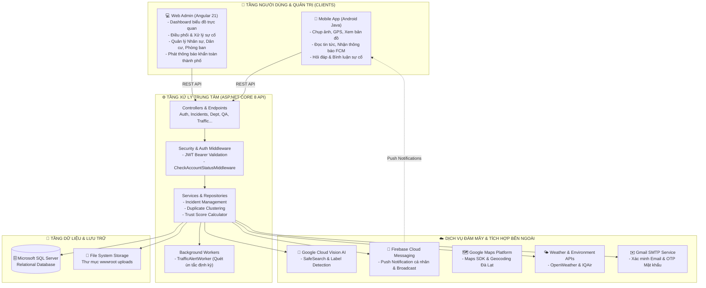

---

<a id="tech-stack"></a>
## 🛠️ Tech Stack Toàn diện

| Phân hệ | Công nghệ / Thư viện | Vai trò & Mục đích sử dụng |
| :--- | :--- | :--- |
| **Backend Core** | **.NET 8 (C#)** | Framework xây dựng RESTful Web API hiệu năng cao, bảo mật cao. |
| | **Entity Framework Core 8** | ORM quản lý dữ liệu, quan hệ bảng, Code-First Migrations. |
| | **Microsoft SQL Server** | Hệ quản trị cơ sở dữ liệu quan hệ, lưu trữ toàn bộ thực thể. |
| | **JWT Bearer + BCrypt.Net** | Xác thực phân quyền không trạng thái (Stateless Authentication) và băm mật khẩu bảo mật cao. |
| | **Hosted Background Service** | Vận hành tác vụ ngầm định kỳ phân tích điểm nóng giao thông (`TrafficAlertWorker`). |
| | **Swashbuckle / Swagger UI** | Sinh tài liệu kiểm thử API tự động trực quan tại `/swagger`. |
| **Cloud & AI** | **Google Cloud Vision v3.8.0** | Trí tuệ nhân tạo kiểm duyệt ảnh đầu vào (SafeSearch & Label Detection). |
| | **Firebase Admin v3.4.0** | Quản lý kết nối và gửi Push Notification qua FCM protocol. |
| | **Google Maps & Location API** | Hiển thị bản đồ nhiệt, ghim vị trí sự cố, định vị vị trí người dùng. |
| | **OpenWeather & IQAir APIs** | Cung cấp dữ liệu môi trường và thời tiết thực tế tại TP Đà Lạt. |
| | **MailKit / SMTP Gmail** | Dịch vụ gửi email thông báo xác thực, cấp phát OTP và kỷ luật tài khoản. |
| **Web Admin** | **Angular 21 (Modern Angular)** | Single Page Application (SPA), Standalone Components, Reactive Forms. |
| | **TypeScript 5.9** | Ngôn ngữ phát triển phía client với kiểu dữ liệu an toàn. |
| | **Chart.js & ng2-charts 8.0** | Trực quan hóa dữ liệu Dashboard (Biểu đồ Doughnut, Bar, Line). |
| | **FontAwesome 7 Free** | Hệ thống icon chuẩn giao diện quản trị chuyên nghiệp. |
| | **RxJS 7.8** | Xử lý bất đồng bộ, Data Streams và HTTP Interceptors. |
| **Mobile App** | **Android Native (Java 17)** | Ứng dụng di động tối ưu hiệu năng phần cứng cho nền tảng Android. |
| | **Retrofit 2.9 & Gson** | Thư viện HTTP Client gọi REST API và chuyển đổi đối tượng JSON. |
| | **Firebase Messaging 23.4** | Bắt sự kiện thông báo nền và hiển thị Notification trên Android. |
| | **Glide 4.16** | Tải và cache ảnh hiện trường mượt mà với kích thước nén tối ưu. |
| | **Google Play Services Maps 18.2** | Tích hợp bản đồ vệ tinh/giao thông tương tác trực tiếp trong app. |
| | **PhotoView 2.3** | Hỗ trợ người dùng và cán bộ zoom phóng to/thu nhỏ ảnh chi tiết hiện trường. |

---

<a id="cau-truc-thu-muc"></a>
## 📂 Cấu trúc Thư mục Codebase

```text
Project_DaLatS/
├── DalatS/                           # 📱 ỨNG DỤNG ANDROID NATIVE (JAVA)
│   ├── app/
│   │   ├── build.gradle.kts          # Dependencies (Retrofit, Glide, Firebase, Maps)
│   │   ├── google-services.json      # Cấu hình kết nối Firebase Project
│   │   └── src/main/
│   │       ├── AndroidManifest.xml   # Khai báo Permissions, Service FCM & Activities
│   │       ├── java/com/example/dalats/
│   │       │   ├── activity/         # 15+ Màn hình (Main, Report, IncidentDetail, Weather, Map...)
│   │       │   ├── adapter/          # Recycler View Adapters (Incident, Comment, Slider, QA...)
│   │       │   ├── api/              # Retrofit Client, ApiService, DTOs
│   │       │   ├── model/            # Data Models (User, Incident, Notification, Category...)
│   │       │   └── service/          # MyFirebaseService (Xử lý thông báo ngầm)
│   │       └── res/                  # Layouts XML, Drawables, Mipmap, Styles
│   └── build.gradle.kts
│
├── DalatS_Admin/                     # 💻 TRANG QUẢN TRỊ NỀN TẢNG (ANGULAR 21)
│   ├── src/
│   │   ├── app/
│   │   │   ├── guards/               # Route Guards (AuthGuard, AdminGuard)
│   │   │   ├── layout/               # Header, Sidebar, Main Layout
│   │   │   ├── models/               # TypeScript Interfaces (Incident, User, Staff, QA...)
│   │   │   ├── pages/                # Các trang nghiệp vụ:
│   │   │   │   ├── dashboard/        # Bảng biểu thống kê sự cố và cảnh báo
│   │   │   │   ├── incidents/        # Quản lý danh sách & duyệt phản ánh
│   │   │   │   ├── citizens/         # Quản lý dân cư & điểm uy tín (Trust Score)
│   │   │   │   ├── staff/            # Quản lý cán bộ & phân công phòng ban
│   │   │   │   ├── departments/      # Quản lý phòng ban chuyên trách
│   │   │   │   ├── categories/       # Quản lý danh mục sự cố đô thị
│   │   │   │   ├── notification-sender/ # Trung tâm phát thông báo FCM toàn dân
│   │   │   │   ├── qa/               # Tiếp nhận và giải đáp thắc mắc người dân
│   │   │   │   └── login/            # Màn hình đăng nhập quản trị
│   │   │   └── services/             # Angular Injectable Services gọi Backend API
│   │   └── index.html
│   ├── package.json
│   └── angular.json
│
├── SafeDalat_API/                    # ⚙️ BACKEND API SERVER (ASP.NET CORE 8)
│   ├── SafeDalat_API/
│   │   ├── Controllers/              # 10+ RESTful API Controllers
│   │   │   ├── AuthController.cs     # Đăng ký, Đăng nhập, Profile, OTP, FCM Token
│   │   │   ├── IncidentsController.cs# CRUD Sự cố, Lọc, Gộp trùng lặp, Bản đồ
│   │   │   ├── NotificationsController.cs # Quản lý thông báo & Phát sóng Broadcast
│   │   │   ├── DashboardController.cs# Dữ liệu phân tích thống kê cho Admin
│   │   │   ├── QAController.cs       # Diễn đàn Hỏi - Đáp người dân & chính quyền
│   │   │   ├── TrafficController.cs  # Điểm nóng ùn tắc giao thông
│   │   │   └── EnvironmentController.cs # Chỉ số AQI và Thời tiết Đà Lạt
│   │   ├── Data/
│   │   │   ├── AppDbContext.cs       # DbContext Entity Framework Core
│   │   │   └── DemoSeeder.cs         # Trình nạp dữ liệu giả lập mẫu cho Đà Lạt
│   │   ├── Middleware/
│   │   │   └── CheckAccountStatusMiddleware.cs # Khóa phiên làm việc tài khoản vi phạm
│   │   ├── Repositories/
│   │   │   ├── Interface/            # Định nghĩa Interfaces Repository & Services
│   │   │   └── Services/             # Cài đặt dịch vụ (ImageAnalysis AI, FCM, Email, Traffic...)
│   │   ├── Workers/
│   │   │   └── TrafficAlertWorker.cs # Hosted Background Service quét ùn tắc định kỳ
│   │   ├── appsettings.json          # Cấu hình Connection String, JWT, API Keys
│   │   ├── firebase-key.json         # Firebase Admin Service Account Key
│   │   ├── safedalat-key.json        # Google Cloud Vision Service Account Key
│   │   └── Program.cs                # Entry point cấu hình DI, Pipeline & Middleware
│   ├── scripts/                      # Script Powershell kiểm thử và nạp ảnh demo
│   ├── DEMO.md                       # Tài liệu dữ liệu mẫu chi tiết của hệ thống
│   └── SafeDalat_API.sln
│
└── docs/                             # 📸 TÀI LIỆU & HÌNH ẢNH DỰ ÁN
    └── images/
        ├── logo.png                  # Logo chính thức của DalatS
        ├── mobile/                   # 6 ảnh chụp màn hình ứng dụng di động
        └── web/                      # 8 ảnh chụp màn hình trang quản trị Web
```

---

<a id="phan-he-chuc-nang"></a>
## 🎯 Phân hệ Chức năng Chi tiết

<a id="mobile-app"></a>
### 📱 Ứng dụng Di động (Mobile App - Dành cho Người dân)
* **Xác thực & Bảo mật:** Đăng ký tài khoản có xác minh Email qua liên kết kích hoạt an toàn. Đổi mật khẩu, quên mật khẩu thông qua mã xác minh OTP gửi vào hòm thư.
* **Gửi Phản ánh Sự cố Đa phương tiện:**
  - Chụp ảnh trực tiếp từ Camera hoặc chọn từ thư viện ảnh.
  - Tự động lấy tọa độ GPS chính xác tại hiện trường và gợi ý địa chỉ tuyến đường/phường nội thành Đà Lạt.
  - Chọn danh mục sự cố: Giao thông, Vệ sinh môi trường, Cây xanh, Chiếu sáng, Thoát nước...
  - Thiết lập mức độ khẩn cấp (Bình thường, Vàng, Cam, Đỏ).
  - **Tự động kích hoạt Google Cloud Vision AI:** Chặn ngay tại cổng gửi nếu ảnh là ảnh vẽ, meme hài hước, game hoặc ảnh 18+.
* **Bản đồ Sự cố Trực quan (Map View):** Hiển thị bản đồ Google Maps với các marker sự cố đang công khai xung quanh, giúp người dân nắm bắt các đoạn đường đang thi công hoặc nguy hiểm.
* **Hỏi - Đáp Công quyền (Q&A):** Đăng câu hỏi thắc mắc về trật tự đô thị, giấy tờ, an sinh và nhận câu trả lời chính thức từ cán bộ có thẩm quyền.
* **Cộng đồng & Bình luận (Incident Comments):** Cho phép người dân thảo luận, cung cấp thêm thông tin cập nhật dưới từng sự cố.
* **Tiện ích Đô thị Đà Lạt:** Xem dự báo thời tiết theo thời gian thực (nhiệt độ, độ ẩm, khả năng mưa) và chỉ số chất lượng không khí AQI.
* **Hồ sơ Cá nhân & Điểm uy tín:** Quản lý thông tin, theo dõi lịch sử các phản ánh đã gửi và cấp bậc điểm uy tín cá nhân.

---

<a id="web-admin"></a>
### 💻 Trang Quản trị (Web Admin - Dành cho Cán bộ & Quản trị viên)
* **Phân quyền người dùng nghiêm ngặt (RBAC):**
  - **Administrator (Quản trị viên hệ thống):** Toàn quyền truy cập Dashboard thống kê, Quản lý tài khoản công dân, Quản lý nhân viên/cán bộ, Quản lý phòng ban, Danh mục sự cố và Phát thông báo toàn thành phố.
  - **Staff / Manager (Cán bộ phụ trách phòng ban):** Chỉ xem và điều phối các sự cố thuộc thẩm quyền phòng ban mình (ví dụ: Cán bộ Cây xanh chỉ xử lý cây đổ, gãy cành; Cán bộ Chiếu sáng xử lý đèn đường hư hỏng); tham gia trả lời Q&A.
* **Dashboard Phân tích Dữ liệu Hiện đại:**
  - Biểu đồ thống kê tỷ lệ sự cố theo cấp độ khẩn cấp (Xanh, Vàng, Cam, Đỏ).
  - Biểu đồ phân bổ sự cố theo từng danh mục hạ tầng.
  - Thống kê tổng số lượng phản ánh: Chờ duyệt, Đang xử lý, Đã giải quyết xong.
* **Quy trình Xử lý & Điều phối Sự cố:**
  - Xem chi tiết hình ảnh độ phân giải cao, hỗ trợ phóng to kiểm tra hiện trường.
  - Xem vị trí chính xác trên bản đồ số.
  - Điều phối chuyển giao sự cố về đúng phòng ban xử lý.
  - Cập nhật trạng thái kèm ghi chú kết quả giải quyết.
  - Tự động cộng (+10) hoặc trừ (-20) điểm uy tín của công dân gửi phản ánh.
* **Phát hiện & Xử lý Trùng lặp (Merge Incidents):** Phát hiện các phản ánh trùng vị trí/nội dung và gộp vào sự cố gốc để tối ưu quy trình xử lý.
* **Quản lý Dân cư & Kiểm soát Vi phạm:**
  - Danh sách công dân, tra cứu điểm uy tín, số lượng phản ánh đúng/sai.
  - Chức năng Khóa/Mở khóa tài khoản: Nhập lý do vi phạm, hệ thống tự động gửi Email thông báo chính thức đến công dân và kích hoạt middleware chặn đăng nhập tức thì.
* **Trung tâm Phát sóng Thông báo Toàn thành phố (Notification Sender):**
  - Gửi bản tin thông báo (thông thường hoặc khẩn cấp) đến hàng ngàn thiết bị di động của người dân trong nháy mắt thông qua Firebase Cloud Messaging.

---

<a id="hinh-anh-giao-dien"></a>
## 📸 Hình ảnh Giao diện Thực tế (UI Gallery)

<a id="ui-mobile-app"></a>
### Giao diện Mobile App

| Trang chủ & Bản tin | Báo cáo sự cố (Tích hợp AI) | Chi tiết sự cố & Tiến độ |
| :---: | :---: | :---: |
| 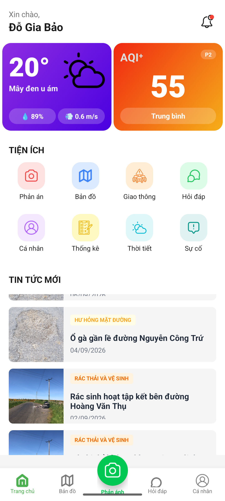 | 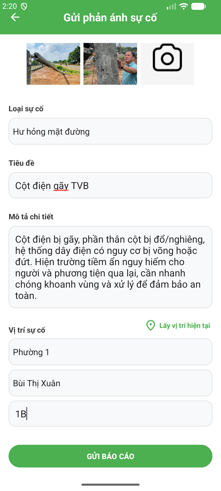 | 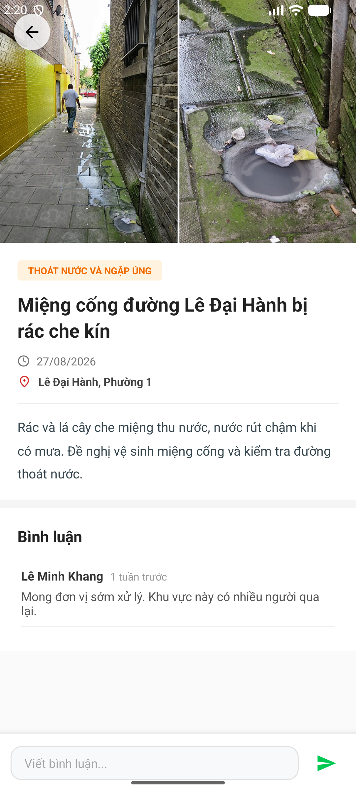 |

| Bản đồ số sự cố đô thị | Chuyên mục Hỏi - Đáp (Q&A) | Hồ sơ & Điểm uy tín |
| :---: | :---: | :---: |
| 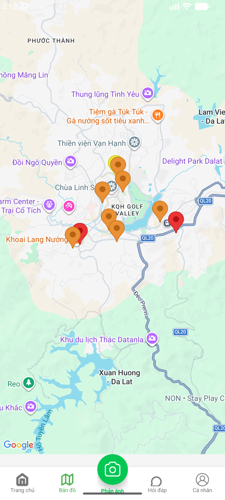 | 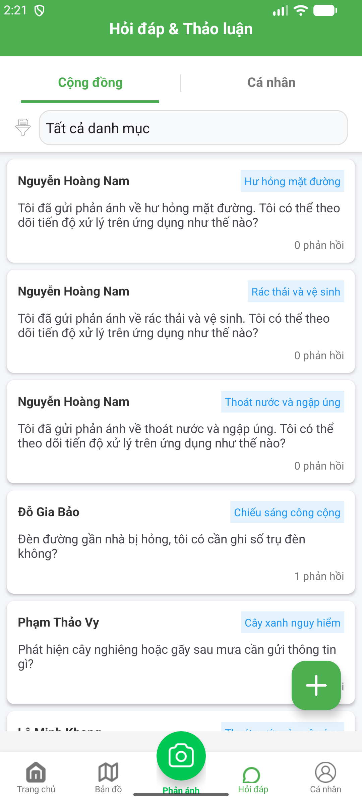 | 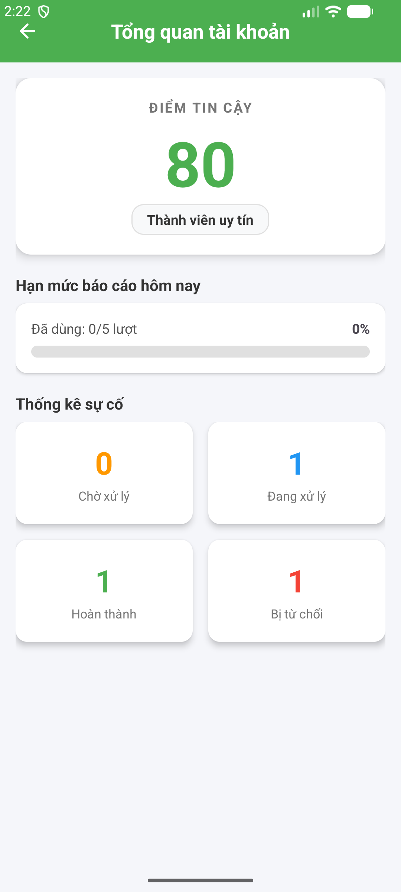 |

---

<a id="ui-web-admin"></a>
### Giao diện Web Admin

#### 1. Dashboard Thống kê Trực quan & Giám sát Toàn diện
<p align="center">
  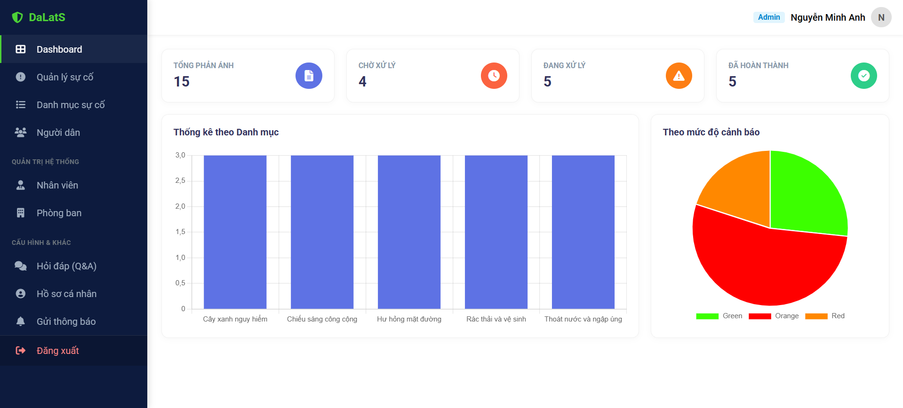
</p>

#### 2. Tiếp nhận & Điều phối Sự cố Đô thị
<p align="center">
  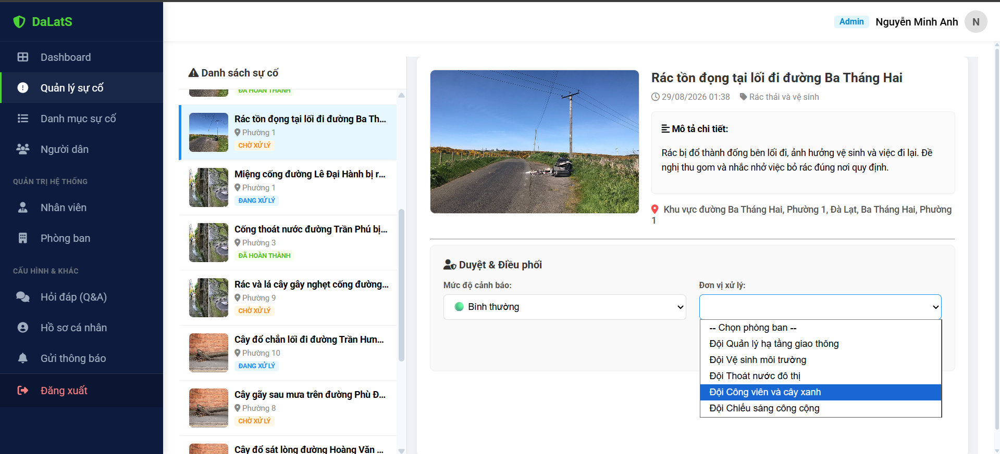
</p>

#### 3. Quản lý Dân cư & Điểm uy tín Công dân
| Danh sách Người dân & Điểm uy tín | Hồ sơ Chi tiết & Lịch sử Báo cáo |
| :---: | :---: |
| 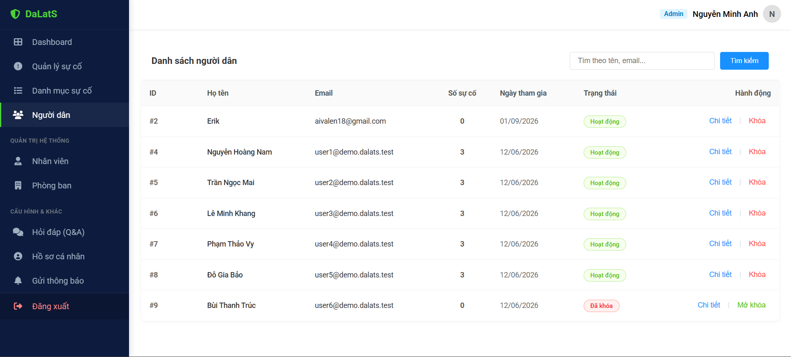 | 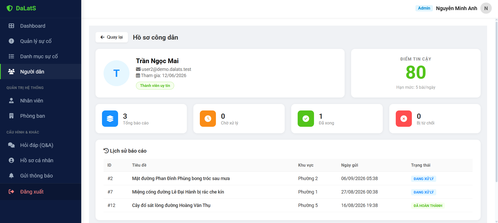 |

#### 4. Quản lý Nhân sự & Phân bổ Phòng ban Chuyên trách
| Danh sách Cán bộ theo Đơn vị | Hồ sơ Cán bộ & Phân quyền |
| :---: | :---: |
| 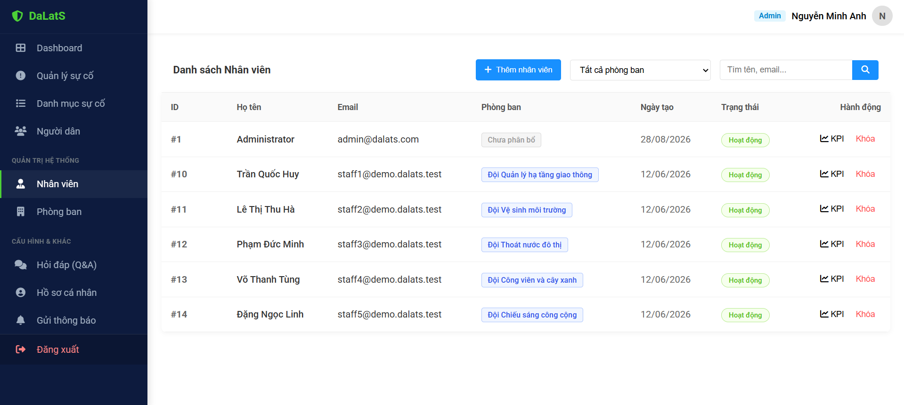 | 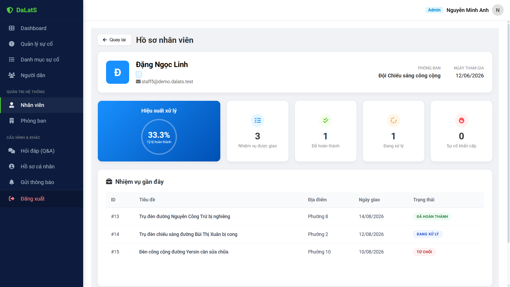 |

#### 5. Quản lý Danh mục Sự cố & Giải đáp Thắc mắc (Q&A)
| Danh mục Phân loại Sự cố | Quản lý & Phản hồi Hỏi - Đáp |
| :---: | :---: |
| 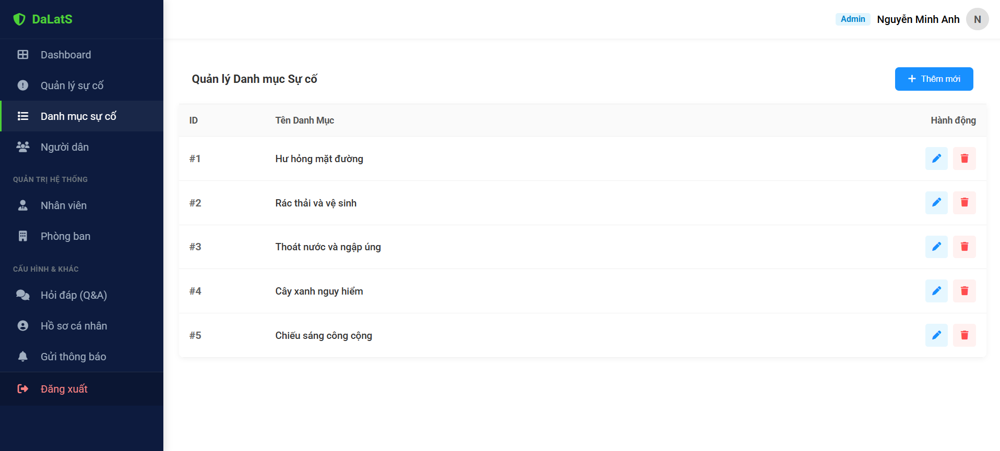 | 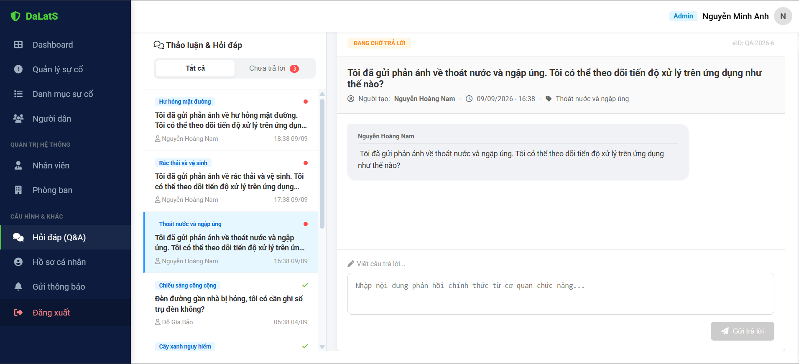 |

---

<a id="tai-khoan-demo"></a>
## 👥 Tài khoản Demo & Dữ liệu Mẫu (Demo Data)

 **Seeder tự động** (`DemoSeeder.cs`) dữ liệu demo chạy test

> [!NOTE]
> 📌 **Xem chi tiết hướng dẫn nạp dữ liệu mẫu và kịch bản test tại:** 👉 **[DEMO.md](SafeDalat_API/DEMO.md)**

---

<a id="huong-dan-cai-dat"></a>
## 🚀 Hướng dẫn Cài đặt & Khởi chạy từ A-Z

<a id="yeu-cau-moi-truong"></a>
### 1. Yêu cầu Môi trường (Prerequisites)
* **Hệ điều hành:** Windows 10/11, macOS, hoặc Linux.
* **.NET SDK:** Phiên bản **.NET 8.0 SDK** trở lên.
* **Node.js & npm:** Node.js **>= v18** (khuyến nghị v20.x hoặc v22.x LTS) và npm.
* **Cơ sở dữ liệu:** Microsoft SQL Server 2019/2022 hoặc SQL Server Express / LocalDB.
* **Mobile Tooling:** Android Studio (phiên bản Hedgehog / Iguana / Koala trở lên) và JDK 17.

---

<a id="cai-dat-backend-api"></a>
### 2. Cấu hình & Khởi chạy Backend API

#### Bước 2.1: Clone dự án & Điều hướng thư mục
```bash
git clone https://github.com/Danter34/Project_DaLatS.git
cd Project_DaLatS/SafeDalat_API/SafeDalat_API
```

#### Bước 2.2: Cấu hình `appsettings.json`
Mở file `appsettings.json` và cập nhật thông số kết nối cơ sở dữ liệu cùng các khóa dịch vụ của bạn:
```json
{
  "ConnectionStrings": {
    "SafeDalatConnection": "Server=localhost;Database=dalats;Integrated Security=True;TrustServerCertificate=True;"
  },
  "Jwt": {
    "Key": "YOUR_SECRET_KEY_AT_LEAST_32_CHARACTERS_LONG_123456",
    "Issuer": "http://localhost:5084",
    "Audience": "http://localhost:5084",
    "ExpireHours": 6
  },
  "Email": {
    "Host": "smtp.gmail.com",
    "Port": 587,
    "Username": "your_email@gmail.com",
    "Password": "your_app_password"
  },
  "IQAir": {
    "ApiKey": "YOUR_IQAIR_API_KEY"
  },
  "OpenWeather": {
    "ApiKey": "YOUR_OPENWEATHER_API_KEY"
  }
}
```

#### Bước 2.3: Thêm khóa Cloud Vision & Firebase
Đặt các file khóa ủy quyền sau vào thư mục `SafeDalat_API/SafeDalat_API/`:
1. `firebase-key.json`: Tải từ Firebase Console -> *Project Settings* -> *Service Accounts* -> *Generate new private key*.
2. `safedalat-key.json`: Tải từ Google Cloud Console -> *IAM & Admin* -> *Service Accounts* (có quyền truy cập Cloud Vision API).

#### Bước 2.4: Nạp dữ liệu Seeder Demo & Chạy ứng dụng
Mở terminal tại thư mục `Project_DaLatS`:

```powershell
# Chạy nạp dữ liệu mẫu Demo (Chỉ cần chạy 1 lần duy nhất)
dotnet run --project SafeDalat_API/SafeDalat_API/SafeDalat_API.csproj --launch-profile http -- --seed-demo

# Khởi chạy Backend API Server
dotnet run --project SafeDalat_API/SafeDalat_API/SafeDalat_API.csproj --launch-profile http
```
* Ứng dụng Backend sẽ chạy tại: **`http://localhost:5084`**
* Kiểm thử trực quan qua Swagger UI: **`http://localhost:5084/swagger`**

---

<a id="cai-dat-web-admin"></a>
### 3. Cấu hình & Khởi chạy Web Admin

#### Bước 3.1: Cài đặt Dependencies
```bash
cd Project_DaLatS/DalatS_Admin
npm install
```

#### Bước 3.2: Khởi chạy Development Server
```bash
npm start
# hoặc
ng serve --port 4200
```
* Mở trình duyệt và truy cập: **`http://localhost:4200`**
* Đăng nhập với tài khoản Admin: `admin@demo.dalats.test` / `DalatS@Demo2026`.

---

<a id="cai-dat-mobile-app"></a>
### 4. Cấu hình & Khởi chạy Mobile App (Android)

#### Bước 4.1: Mở dự án trong Android Studio
* Mở **Android Studio** -> Chọn **Open** -> Điều hướng đến thư mục `Project_DaLatS/DalatS`.
* Chờ Gradle Sync hoàn tất tải các thư viện.

#### Bước 4.2: Cấu hình `google-services.json` & Maps API Key
* Đảm bảo file `DalatS/app/google-services.json` khớp với cấu hình Firebase App của bạn (Package name: `com.example.dalats`).
* Mở `DalatS/app/src/main/AndroidManifest.xml` và điền Google Maps API Key vào thẻ:
  ```xml
  <meta-data
      android:name="com.google.android.geo.API_KEY"
      android:value="YOUR_GOOGLE_MAPS_API_KEY" />
  ```

#### Bước 4.3: Lưu ý về địa chỉ kết nối API (`BASE_URL`)
* Mặc định trong code, Retrofit kết nối tới Backend thông qua `http://10.0.2.2:5084/` (địa chỉ Loopback tiêu chuẩn của **Android Emulator** trỏ về máy tính Host).
* Nếu chạy trên **Thiết bị thật (Real Phone)** qua cáp USB / Wi-Fi, mở file `DalatS/app/src/main/java/com/example/dalats/api/ApiClient.java` và đổi thành địa chỉ IP nội mạng của máy tính bạn (ví dụ: `http://192.168.1.15:5084/`).

#### Bước 4.4: Build & Run
* Chọn thiết bị Emulator hoặc điện thoại thật đã bật chế độ Developer Mode.
* Nhấn nút **Run 'app' (Shift + F10)** trên thanh công cụ để trải nghiệm ứng dụng.

---

<a id="danh-muc-api"></a>
## 📡 Danh mục API Endpoints (RESTful API)

Dưới đây là tóm tắt các cụm API tiêu biểu của hệ thống:

### 🔐 1. Xác thực & Tài khoản (`/api/Auth`)
* `POST /api/Auth/register`: Đăng ký tài khoản người dân mới (gửi email kích hoạt).
* `POST /api/Auth/login`: Đăng nhập hệ thống, trả về JWT Token và thông tin User.
* `GET  /api/Auth/verify-email`: Xác nhận kích hoạt tài khoản qua Token Email.
* `POST /api/Auth/forgot-password`: Yêu cầu mã xác minh OTP đặt lại mật khẩu.
* `POST /api/Auth/reset-password`: Thiết lập mật khẩu mới bằng OTP.
* `GET  /api/Auth/profile`: Lấy thông tin cá nhân của người dùng đang đăng nhập.
* `PUT  /api/Auth/update-fcm`: Cập nhật FCM Device Token nhận Push Notification.
* `PUT  /api/Auth/{id}/lock` & `unlock`: [Admin] Khóa hoặc mở khóa tài khoản vi phạm.
* `POST /api/Auth/create-staff`: [Admin] Cấp phát tài khoản cán bộ phòng ban.

### 🚨 2. Sự cố Đô thị (`/api/Incidents`)
* `POST /api/Incidents`: Tạo báo cáo sự cố mới kèm ảnh hiện trường (Tự động kiểm duyệt AI Vision).
* `GET  /api/Incidents`: Tra cứu, phân trang, lọc theo trạng thái, phòng ban, phường, mức độ khẩn cấp.
* `GET  /api/Incidents/{id}`: Chi tiết thông tin sự cố, ảnh, lịch sử trạng thái và bình luận.
* `PUT  /api/Incidents/{id}/status`: [Cán bộ/Admin] Chuyển trạng thái, điều phối phòng ban, cập nhật Trust Score.
* `GET  /api/Incidents/suggest-duplicates/{id}`: Gợi ý các sự cố trùng lặp trên cùng tuyến đường.
* `POST /api/Incidents/merge`: Hợp nhất các sự cố trùng lặp thành một sự cố chính.
* `GET  /api/Incidents/map`: Lấy danh sách sự cố công khai hiển thị trên bản đồ số.

### 💬 3. Tương tác & Bình luận (`/api/IncidentComments`)
* `GET  /api/IncidentComments/{incidentId}`: Lấy danh sách bình luận theo từng sự cố.
* `POST /api/IncidentComments/{incidentId}`: Gửi trao đổi/bình luận mới của người dân hoặc cán bộ.

### ❓ 4. Hỏi - Đáp Công quyền (`/api/QA`)
* `GET  /api/QA`: Danh sách các câu hỏi của người dân.
* `POST /api/QA`: Người dân gửi câu hỏi mới đến cơ quan chức năng.
* `POST /api/QA/{id}/answer`: [Cán bộ] Trả lời giải đáp chính thức câu hỏi.

### 📢 5. Thông báo & Phát thanh (`/api/Notifications`)
* `GET  /api/Notifications/my-notifications`: Danh sách thông báo cá nhân của người dùng.
* `PUT  /api/Notifications/{id}/read`: Đánh dấu đã đọc thông báo.
* `POST /api/Notifications/broadcast`: [Admin] Phát thông báo đẩy diện rộng qua Firebase FCM.

### 📊 6. Dashboard & Phân tích (`/api/Dashboard`)
* `GET /api/Dashboard/summary`: [Admin] Thống kê tổng số lượng sự cố theo trạng thái xử lý.
* `GET /api/Dashboard/by-alert`: [Admin] Thống kê tỷ lệ sự cố theo cấp độ cảnh báo.
* `GET /api/Dashboard/by-category`: [Admin] Thống kê sự cố phân bổ theo danh mục hạ tầng.

### 🚦 7. Giao thông & Môi trường (`/api/Traffic` & `/api/Environment`)
* `GET /api/Traffic/hotspots`: Danh sách các tuyến đường điểm nóng có nguy cơ ùn tắc cao.
* `GET /api/Environment/weather`: Dự báo thời tiết tại Đà Lạt từ OpenWeather API.
* `GET /api/Environment/air-quality`: Chỉ số chất lượng không khí AQI tại Đà Lạt từ IQAir API.

---
